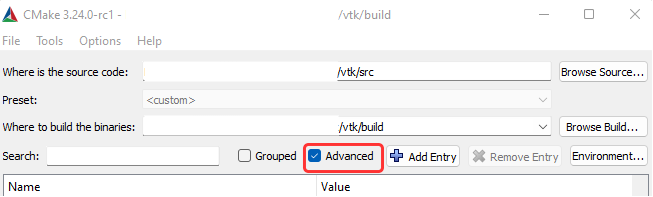

# Integrating with VTK (open source C++ library integrated ability of 3D rendering with supportibility to the Looking Glass (the Light Field Display))
## Build and Install (Windows tutorial only.. so far.. may test on macOS/Linux and update this README)
### Prereq
1. Visual Studio Community (not Visual Studio Code)
2. CMake (recommended with GUI (Graphical User Interface))
3. Git
#### HoloPlay
1. HoloPlay Service (Essential service to communicate with the display, download from https://lookingglassfactory.com/software)
2. Holoplay Core SDK (Need to request from https://lookingglassfactory.com/software) 
 
 (Secret: The manufacture somehow makes the "Beta application accepted" webpage fixed at https://lookingglassfactory.com/devtools/holoplay-core, no need to login nor request (sad fact: no one resposes to the request), but a Github account is required to access it)

### Build
There are several instructions to follow:
1. https://gitlab.kitware.com/vtk/vtk/-/blob/master/Documentation/dev/build.md
2. https://gitlab.kitware.com/vtk/vtk/-/blob/master/Documentation/dev/build_windows_vs.md
3. https://github.com/Kitware/LookingGlassVTKModule
4. https://lookingglassfactory.com/software#vtk

After multiple attempts of failed built, here is how I successfully build it. 
1. Follow instruction 3 (Section `Build Requirements`), to allow CMake automatically find the directory of `HoloPlayCore SDK`.
2. Follow instruction 1, to install other prereqs (Except `Ninja`. It is fast, but it fails while building) and to clone the VTK git repo (STOP before the `Building` section)
3. Follow instruction 2, proceed from `BUILD SOLUTION` section. STOP before the step 3 in subsection `Run CMake`. 
4. Check the box "Advanced" of CMake GUI as shown in the figure below.
 
5. Proceed instruction 2. STOP before step 6.
 - It basically just click `Configure`, and choose the current version of Visual Studio installed on computer. If there isn't, choose the latest version in the list. 
 - Set the flag `CMAKE_CXX_MP_FLAG`.
6. Follow instruction 3 (Section `CMake Configuration of VTK`)
 - Add flag `VTK_MODULE_ENABLE_VTK_RenderingLookingGlass` to the list (since it is not in the list)
  - - Click `Add Entry`
  - - Name: `VTK_MODULE_ENABLE_VTK_RenderingLookingGlass`, Type: `String` (NOT BOOL), Value: `YES` (ALL CAPITAL LETTERS) DO NOT set it to 'ON' as instructed in instruction 4. 
 - Set other 2 flags (`VTK_USE_VIDEO_FOR_WINDOWS` and `VTK_USE_MICROSOFT_MEDIA_FOUNDATION`). 
 - DO NOT set `VTK_BUILD_TESTING` as instructed in instruction 4 (If set, the building time takes about 45 mins on Intel i7-11800H. If not set, the building time takes about 10 mins.)
 - DO NOT set `VTK_BUILD_DOCUMENTATION`, or the `Install` process in later procedure may fail. 
7. Back to instruction 2. To avoid redundancy of procedure steps, set the `CMKAE_INSTALL_PREFIX` directory at this step (As instructed in Section `INSTALL`. This is where the final DLL library files stored.). 
8. Click `Generate`, as instruacted in `instruction 2` - `BUILD SOLUTION` - `Run CMake` - step 7. (Yes, there is no need to do step 6 nor 8)
#### Install
1. Run Visual Studio as administrator. Method is shown in `instruction 2` - `INSTALL`. 
2. Open the `VTK.sln` in `build`.
3. Set to `Release` Mode, as shown in the figure below. 
 
4. Right click `ALL_BUILD` and click `build`. 
5. Set back to `Debug` Mode. 
6. Right click `INSTALL` project and click `Set as Startup Project`. 
7. Right click	`INSTALL` project and click	`build`. 
8. Add the subdirectory `\bin` in the path set in step 7 (flag `CMKAE_INSTALL_PREFIX`) into System Environment Path. May need reboot the computer to make it effective. 
9. Follow `TEST WITH AN EXAMPLE` section to test the build. 